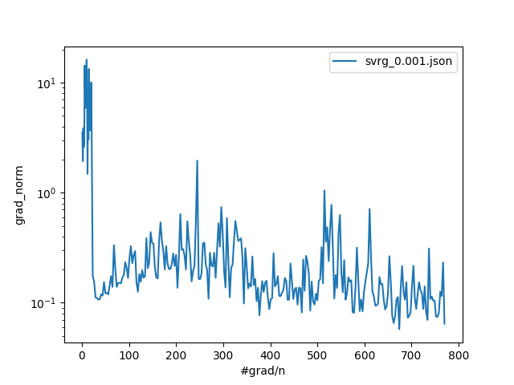
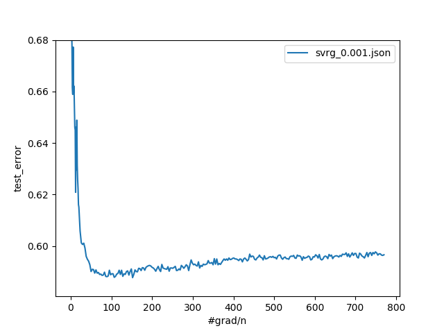
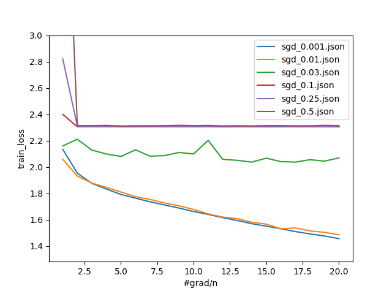
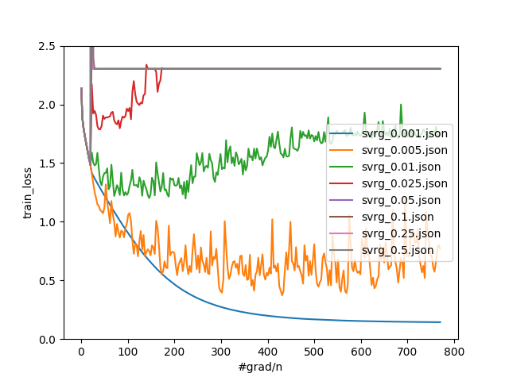

# Nonconvex STL10

STL10 experiment from p.11 of "Stochastic Variance Reduction for Nonconvex Optimization".

## Results






## Hyperparameters

* Layers: [27648, 100, 10]
* L2 Regularization: 1e-2
* Batch Size: 10
* Warmup Epochs: 20
* Inner Epochs: 1
* Outer Epochs: At most 300
* Learning Rate: Tuned on Training Loss (0.001)
* Warmup Learning Rate: Tuned on Training Loss (0.001)


## Commands
```bash
# SVRG Run
python train.py \
  --seed 77 \
  --optimizer SVRG \
  --run_name svrg_0.001.json \
  --output_path experiments/nonconvex_stl10/svrg-0.001.json \
  --dataset STL10 \
  --layer_sizes 27648 100 10 \
  --batch_size 10 \
  --learning_rate 0.001 \
  --weight_decay 0.01 \
  --warmup_learning_rate 0.001 \
  --num_warmup_epochs 20 \
  --num_outer_epochs 250 \
  --num_inner_epochs 1 \
  --device cuda

# Plots
python plot.py \
  --run_paths experiments/nonconvex_stl10/svrg-0.001.json \
  --key train_loss \
  --save_path experiments/nonconvex_stl10/train_loss.png
python plot.py \
  --run_paths experiments/nonconvex_stl10/svrg-0.001.json \
  --key grad_norm \
  --log_scale \
  --save_path experiments/nonconvex_stl10/grad_norm.png
python plot.py \
  --run_paths experiments/nonconvex_stl10/svrg-0.001.json \
  --key test_error \
  --y_top 0.68 \
  --save_path experiments/nonconvex_stl10/test_error.png
```

## Hyperparameter Tuning

```bash
# Warmup Learning Rate Search
for lr in 0.5 0.25 0.1 0.03 0.01 0.001; do python train.py \
  --seed 12 \
  --optimizer SGD \
  --run_name sgd_$lr.json \
  --output_path experiments/nonconvex_stl10/warmup-$lr.json \
  --dataset STL10 \
  --layer_sizes 27648 100 10 \
  --batch_size 10 \
  --learning_rate $lr \
  --weight_decay 0.01 \
  --num_epochs 20
done
python plot.py \
  --run_paths experiments/nonconvex_stl10/warmup-*.json \
  --key train_loss \
  --y_top 3.0 \
  --save_path experiments/nonconvex_stl10/warmup_results.png

# SVRG Learning Rate Search
for lr in 0.5 0.25 0.1 0.05 0.025 0.01 0.005 0.001; do python train.py \
  --seed 77 \
  --optimizer SVRG \
  --run_name svrg_$lr.json \
  --output_path experiments/nonconvex_stl10/svrg-$lr.json \
  --dataset STL10 \
  --layer_sizes 27648 100 10 \
  --batch_size 10 \
  --learning_rate $lr \
  --weight_decay 0.01 \
  --warmup_learning_rate 0.001 \
  --num_warmup_epochs 20 \
  --num_outer_epochs 250 \
  --num_inner_epochs 1 \
  --device cuda
done
python plot.py \
  --run_paths experiments/nonconvex_stl10/svrg-*.json \
  --key train_loss \
  --y_top 2.5 \
  --y_bottom 0. \
  --save_path experiments/nonconvex_stl10/svrg_results.png
```

### Warmup Learning Rate Results


### SVRG Learning Rate Results

